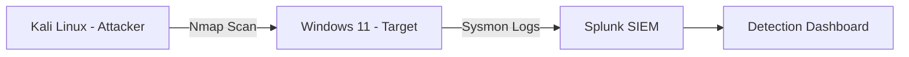
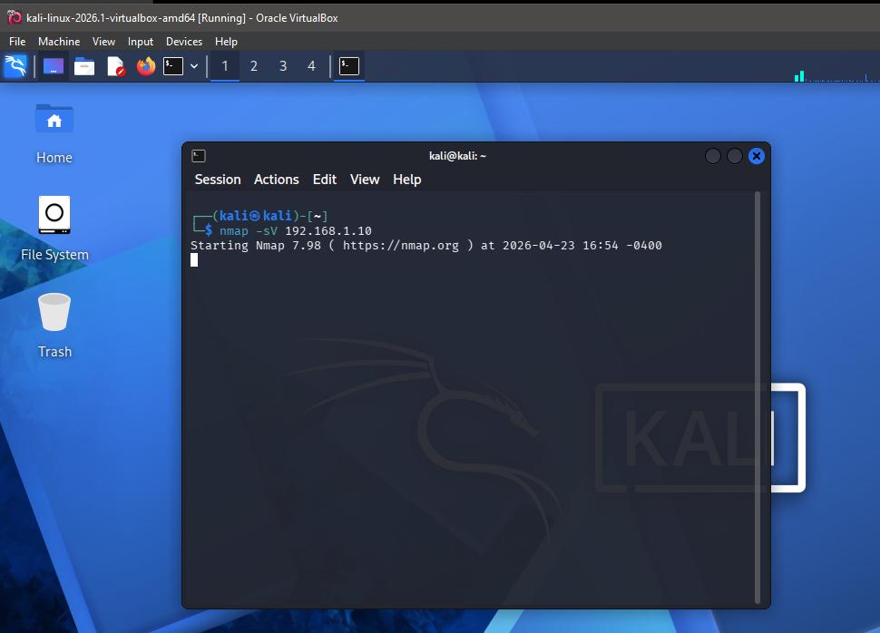
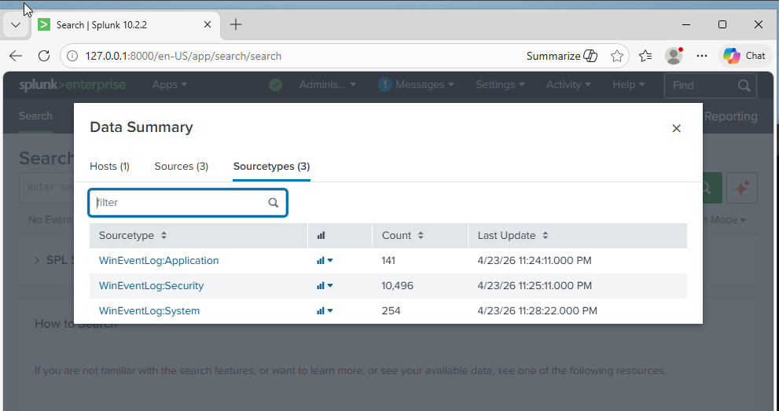
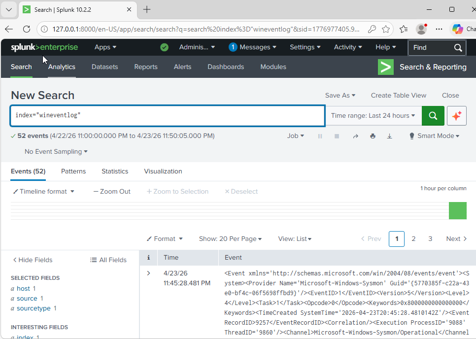
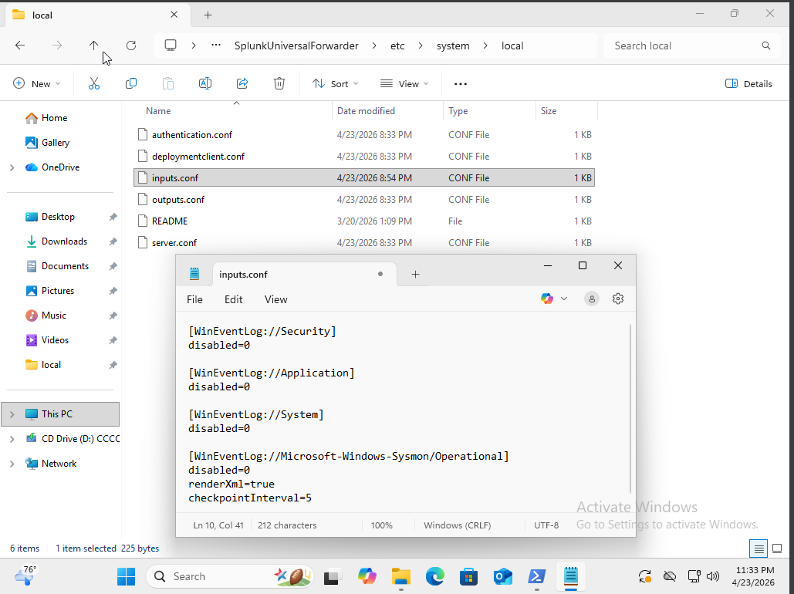
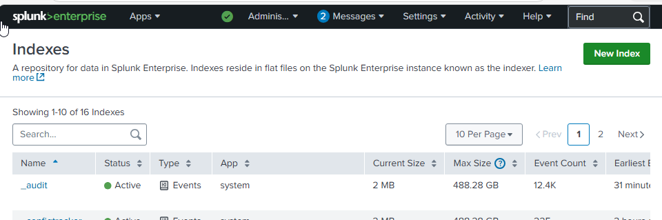

# 🛡️ SOC Detection Lab – Splunk + Sysmon + Kali Attack Simulation

## 🔍 Overview

This project is a Security Operations Center (SOC) lab designed to simulate real-world attacker behavior and detect it using Splunk SIEM and Sysmon telemetry.

The lab demonstrates how adversary activity is generated, collected, and analyzed using:

- Kali Linux (attacker machine)
- Windows 11 (target endpoint)
- Sysmon (endpoint monitoring)
- Splunk Enterprise (SIEM platform)

The goal is to simulate reconnaissance attacks and detect them using SIEM correlation rules mapped to MITRE ATT&CK.

---

## 🧱 SOC Architecture



---

## 💻 Environment

- Kali Linux (Attacker)
- Windows 11 (Target)
- Splunk Enterprise (SIEM)
- Sysmon (Endpoint monitoring)

---

## ⚔️ Attack Simulation

### 🔍 Network Reconnaissance (Nmap Scan)

A port scan was performed against the target system to identify open services.



---

### 🧠 Endpoint Monitoring (Sysmon)

Sysmon captured process execution and network activity during the attack simulation.





---

### 📥 Log Ingestion (Splunk)

Logs were forwarded into Splunk for ingestion and indexing.



---

## 📊 Detection (Splunk SIEM)

### Reconnaissance Detection Query

```spl
index=sysmon EventCode=3
| stats count by SourceIp, DestinationPort
| sort -count
```

---

### Port Scan Detection Logic

```spl
index=sysmon EventCode=3
| bin _time span=1m
| stats dc(DestinationPort) as unique_ports by SourceIp, _time
| where unique_ports > 20
```

---

### Splunk Dashboard



---


## 🚀 Skills Demonstrated

- SIEM deployment (Splunk)
- Endpoint detection (Sysmon)
- Network reconnaissance (Nmap)
- Log analysis and correlation
- SPL query development
- MITRE ATT&CK mapping
- SOC workflow simulation

---

## 📌 Key Takeaway

This lab demonstrates how attacker behavior can be:

- Simulated using controlled tools  
- Captured via endpoint telemetry  
- Centralized in a SIEM  
- Detected using correlation rules  
